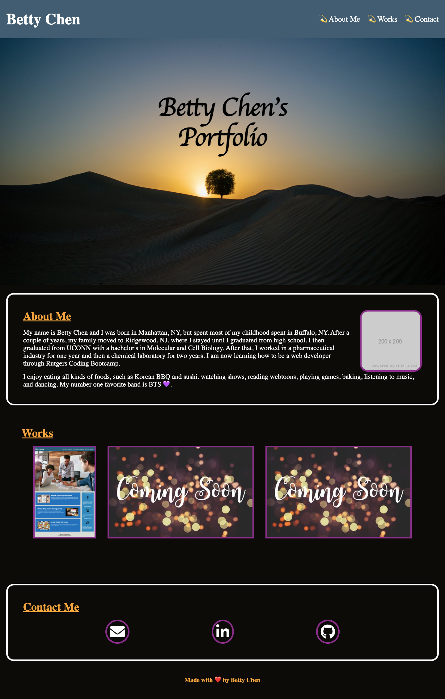

# **Portfolio**

## **Description**

Making my first professional portfolio.

**HTML, CSS, and Normalize CSS**

Used template from Code Refactoring Project to create the base of HTML and CSS. Found a template for normalized css online. Peformed code refactoring such that it is modified and changed according to my needs and keep its functionality.

- **HTML** - Codes were changed/added to resemble portfolio. Images with their alt tag were added for aesthetic and represent Works Applications.

- **CSS** - Selectors were modified accordingly to the HTML file. Advanced CSS, such as Media Query, Pseudo-Classes and Pseudo-Elements were used to style the website and make it responsive across all devices and browsers.

## **Screenshot**

## **Github Page Link**

[Link to Github Page!](https://bchen41.github.io/Portfolio/)

Author: Betty Chen
